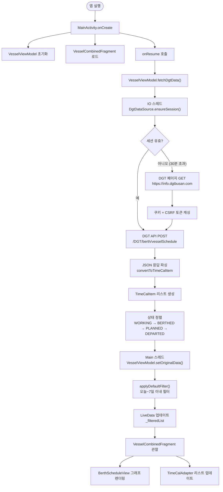
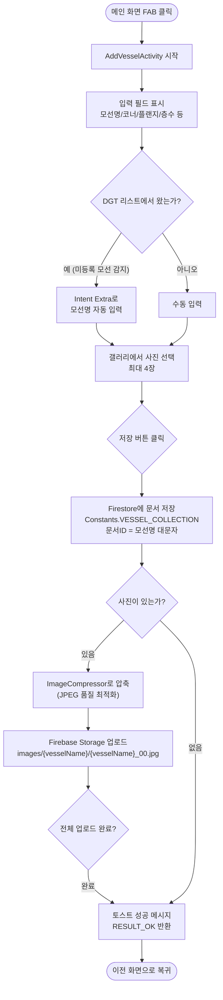
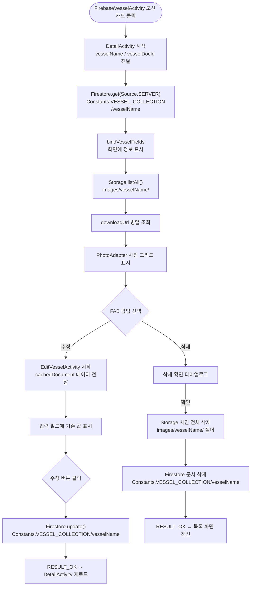
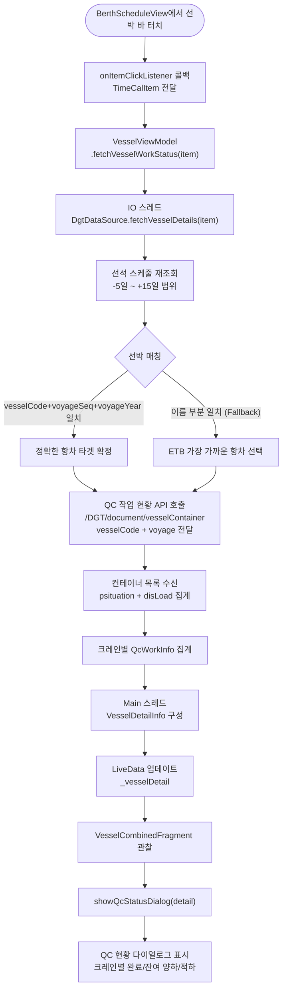
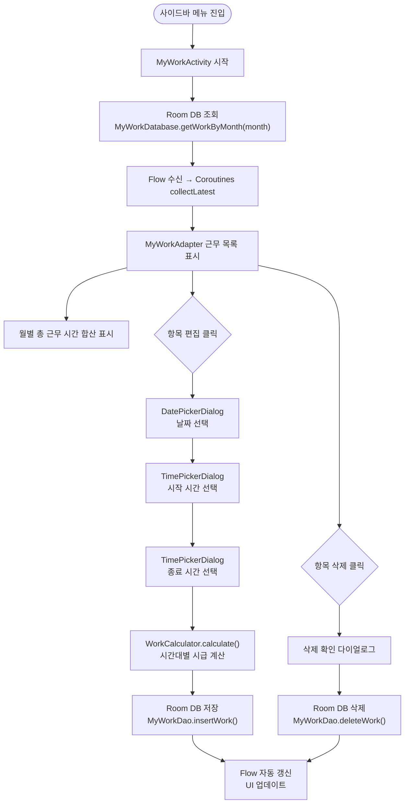
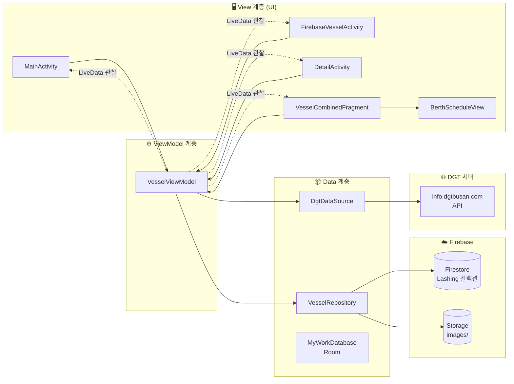

# VesselV2 앱 실행 흐름도 (FLOWCHART)

> 제 3자가 한눈에 파악할 수 있도록 앱의 주요 기능별 실행 순서를 정리한 문서입니다.

---

## 📁 소스 파일 구조 요약

```
app/src/main/java/com/example/vesselv2/
│
├── ui/
│   ├── activity/           ← 각 화면 (Activity)
│   │   ├── MainActivity.kt             (메인: DGT 스케줄 그래프 + 리스트)
│   │   ├── FirebaseVesselActivity.kt   (Firebase 모선 목록)
│   │   ├── AddVesselActivity.kt        (모선 신규 등록)
│   │   ├── EditVesselActivity.kt       (모선 정보 수정)
│   │   ├── DetailActivity.kt           (모선 상세 + 사진 보기)
│   │   ├── AddPhotoActivity.kt         (사진 추가)
│   │   ├── MyWorkActivity.kt           (내 근무 기록)
│   │   ├── BulkCompressActivity.kt     (사진 일괄 압축 관리)
│   │   └── PhotoViewerActivity.kt      (사진 전체화면 보기)
│   │
│   ├── fragment/
│   │   └── VesselCombinedFragment.kt   (그래프 + 리스트 통합 프래그먼트)
│   │
│   ├── viewmodel/
│   │   └── VesselViewModel.kt          (MVVM 상태 관리)
│   │
│   ├── adapter/
│   │   ├── TimeCalAdapter.kt + TimeCalItem  (DGT 리스트 어댑터 + 데이터 모델)
│   │   ├── VesselAdapter.kt            (Firebase 모선 목록 어댑터)
│   │   ├── PhotoAdapter.kt             (사진 그리드 어댑터)
│   │   ├── ImagePreviewAdapter.kt      (사진 미리보기 어댑터)
│   │   └── MyWorkAdapter.kt            (근무 기록 어댑터)
│   │
│   └── view/
│       └── BerthScheduleView.kt        (선석 배정 현황 커스텀 Canvas 뷰)
│
├── data/
│   ├── remote/
│   │   └── DgtDataSource.kt            (DGT 웹 API 크롤링)
│   ├── repository/
│   │   └── VesselRepository.kt         (Firebase Firestore/Storage 접근)
│   ├── local/
│   │   ├── MyWorkDatabase.kt           (Room DB 설정)
│   │   ├── MyWorkDao.kt                (Room DB 쿼리)
│   │   └── MyWorkEntity.kt             (근무 기록 데이터 모델)
│   └── model/
│       ├── Vessel.kt                   (Firebase 모선 데이터 모델)
│       ├── VesselDetail.kt             (QcWorkInfo + VesselDetailInfo 모델)
│       └── VesselPhoto.kt              (사진 데이터 모델)
│
└── util/
    ├── Constants.kt                    (전역 상수)
    ├── NavigationHelper.kt             (사이드바 메뉴 헬퍼)
    ├── WorkCalculator.kt               (시급 계산기)
    ├── ImageCompressor.kt              (이미지 압축 유틸)
    ├── ViewExt.kt                      (View 확장 함수)
    └── WindowExt.kt                    (WindowInsets 확장 함수)
```

---

## 🔵 흐름도 1: 앱 시작 → DGT 스케줄 로드



---

## 🟢 흐름도 2: 모선 추가 등록



---

## 🟡 흐름도 3: 모선 상세 보기 → 수정/삭제



---

## 🔴 흐름도 4: 선석 그래프 → QC 작업 현황 다이얼로그



---

## 🟣 흐름도 5: 내 근무 기록 관리 (MyWorkActivity)



---

## 🔷 흐름도 6: MVVM 구조 데이터 흐름 개요



---

## 🔐 보안 요소 요약

| 항목 | 처리 방식 |
|------|---------|
| `google-services.json` (Firebase 키) | `.gitignore`에 포함 → Git 업로드 안 됨 |
| `local.properties` (SDK 경로) | `.gitignore`에 포함 → Git 업로드 안 됨 |
| `erm.jpg` (비상 연락망 이미지) | `.gitignore`에 포함 → Git 업로드 안 됨 |
| Firestore 컬렉션명 | `Constants.VESSEL_COLLECTION` 상수 사용 (하드코딩 없음) |
| DGT API CSRF 토큰 | 로그에 앞 10자만 출력 (전체 노출 방지) |
| SSL 인증서 우회 | 내부망 전용 → 경고 주석으로 이유 문서화 |
| DGT 로그인 정보 | 사용하지 않음 (세션 쿠키 방식만 사용) |
